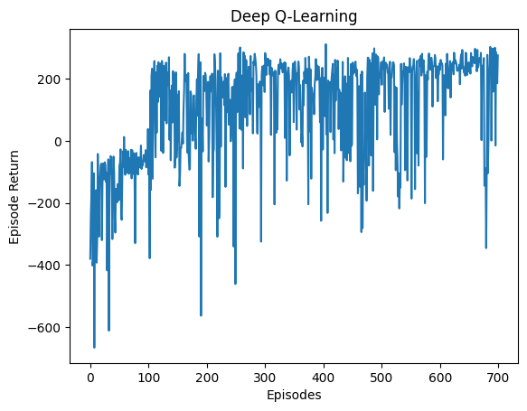

# Deep Q-Networks (DQN) for LunarLander

This project implements a Deep Q-Network (DQN) to solve the LunarLander-v2 environment. The implementation leverages reinforcement learning techniques to train an agent to navigate and land safely on the LunarLander's target pad.

---

## Overview

### Key Modifications:
1. **Batch Size**: Adjusted to 128 for efficient training.
2. **Buffer Size**: Increased to 15,000 to enhance sample diversity.
3. **Scaling**: Implemented local scaling for faster experimentation and trials.
4. **Epsilon Decay**: Extended over 10,000 steps, promoting thorough exploration.

---

## Methodology

### Environment Details:
- **Name**: LunarLander-v2
- **State Space**: 8-dimensional continuous vector.
- **Action Space**: 4 discrete actions:
  1. Do nothing.
  2. Fire left orientation engine.
  3. Fire main engine.
  4. Fire right orientation engine.
- **Reward**: Encourages landing near the target pad with minimal velocity.

### Neural Network Architecture:
- **Input Layer**: Takes the 8-dimensional state vector.
- **Hidden Layers**: Two fully connected layers, each with 20 units.
- **Output Layer**: Four units representing Q-values for each action.

### Core Features:
1. **Replay Buffer**:
   - Stores transitions for experience replay.
   - Size: 15,000.
   - Batch Size: 128.

2. **Target Network**:
   - Periodically updated to stabilize Q-value estimation.
   - Update frequency: 100 training steps.

3. **Exploration Strategy**:
   - Epsilon-greedy policy with linear decay:
     - Initial epsilon: 1.0.
     - Minimum epsilon: 0.15.
     - Decay steps: 10,000.

4. **Optimization**:
   - Loss Function: Mean squared error between predicted Q-values and Bellman targets.
   - Optimizer: Adam with a learning rate of 1e-3.

---

## Training Process

- **Episodes**: 700.
- **Evaluation Period**: Every 10 episodes.
- **Train Frequency**: After every timestep.

**Episode Returns**:


---

## Results

### Performance Metrics:
- Initial Performance: Average return of approximately -380.
- Final Performance: Achieved an average return exceeding 250 after 670 episodes.

### Key Observations:
1. **Exploration Efficiency**: The extended epsilon decay allowed the agent to explore diverse strategies before exploiting learned policies.
2. **Stability**: Replay buffer and target network significantly stabilized training.

**Learned Policy**:


---

## Instructions

1. **Install Dependencies**:
   ```bash
   pip install -r requirements.txt
   ```

2. **Run Training**:
   ```bash
   python lunarlander_dqn.py
   ```

3. **Visualize Results**:
   - Plots and videos will be saved in the `visuals/` directory.

---

## Future Improvements

1. Experiment with advanced architectures (e.g., dueling or double DQNs).
2. Extend to continuous action environments using techniques like Deep Deterministic Policy Gradient (DDPG).
3. Hyperparameter optimization for improved training efficiency.

---

## References
- OpenAI Gym Documentation.
- Haiku and Optax Libraries for Neural Network and Optimization.

---

**End of Report**

